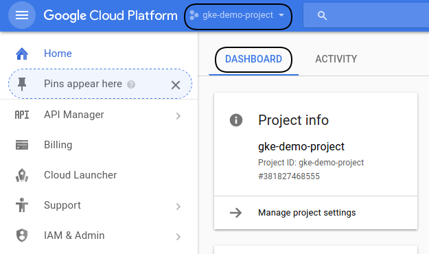
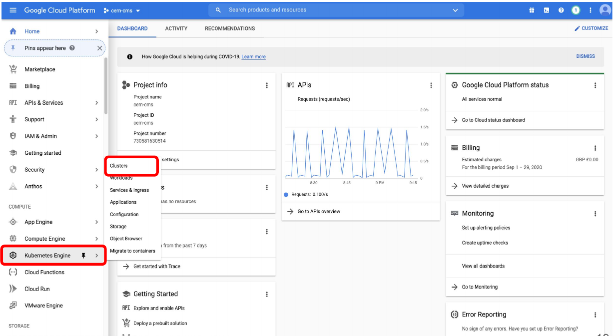
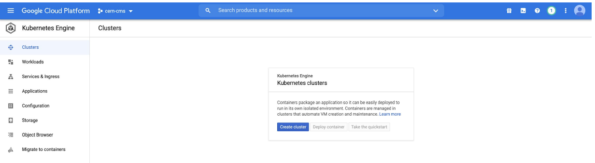
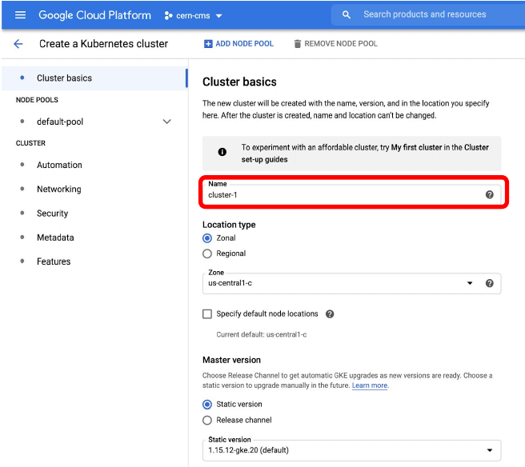
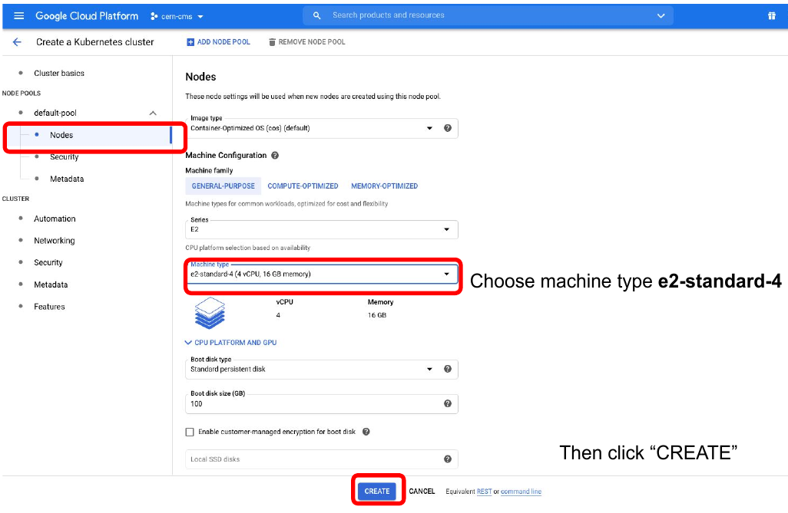
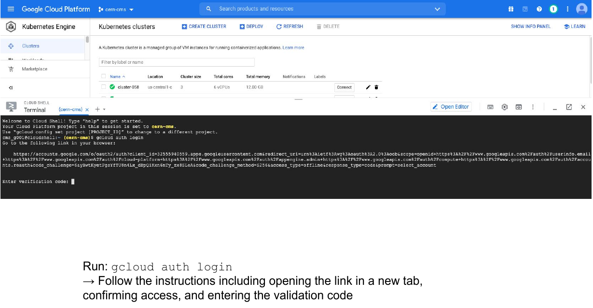
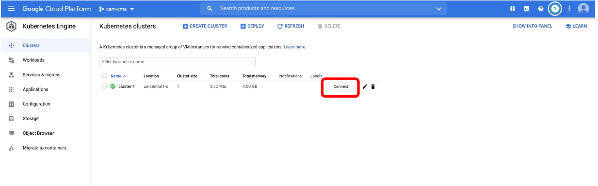
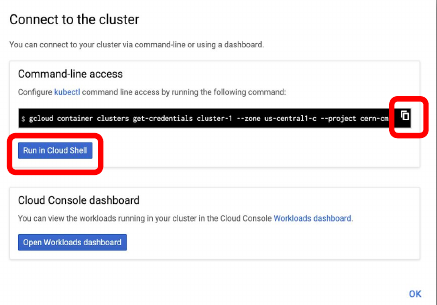

## Introduction

In this demonstration we will show you the very basic way in which you can create a computer cluster (a Kubernetes cluster to be exact) in the cloud so you can do some data processing and analysis using those resources.  In the process we will make sure you learn about the jargon.  During the hands-on session tomorrow, a cluster similar to this one will be provided to you for the exercises.  

## Basic concepts

### The Google Cloud Platform (GCP)

A place on the web that interfaces the user with all the different services that google provide on the *cloud*.




### GCP Console

The exact name of the GCP interface where you can explore all the different services that GCP provides.  They include, but are not limited to individual virtual machines, disk storage, kubernetes clusters, etc.


### Google Kubernetes Engine

A Google service to create Kubernetes clusters and run conteinerized application and/or jobs/workflows.

### Kubernetes (K8s)

Software which orchestrates containers in a computer cluster.  You already had a chance to learn about its architecture.


### Workflow

A series of sequential operations in order to achieve a final result.  In our case it could be, for instance

`skimming` -> `merging output files` -> `EventLoop analysis of resulting files` -> `Plottin histograms`

In the context of the cloud, they are written in `yaml` files.

### Pod

The smallest abstraction layer in a K8s cluter.  For any practical purposes, a pod is an abstraction of a container running in the K8s cluster.


### Deployment

This is an abstraction layer which is above *pods*.  In practice, you always create deployments in K8s, not pods.

### Argo

Argo Workflows is an open source container-native workflow engine for orchestrating parallel jobs on Kubernetes.


## Creating your own cluster on GKE

For the hands-on part of this lesson you will not have to create the cluster for yourself, it will be already done for you.  For pedagogical reasons, however, we will show an example of how to do it by hand.  The settings below should be good and cheap enough for CMSSW-related workflows.

* Get to the Console
* Create a new project or select one of your interest (if you already have one)

* Click on the Kubernetes engine/clusters section on the left side menu

* Select create cluster (standard)

* Give it a name

* Many ways to configure the cluster, but let's try an efficient one with autoscaling
* Go to default pool
* Choose size: 1 node
* Autoscaling 0 to 4
  
* Go to Nodes
* Choose a machine e2-standar-4
* Leave the rest as it is
* Hit create

* Creation will take while

While we wait, lets inspect the Cloud shell...

## Cloud shell

GCP provides an *access machine* so you can interact with their different services, including our newly created K8s cluster.  This machine (and the terminal) is not really part of the cluster. As was said, it is an entry point.  From here you could *connect* to your cluster.


* Get verified for login, type:
```
gcloud auth login
```
Then follow the proceure for the verification.


This is something you will have to do only once.  For the hands-on part of the lesson, it is likely that you were already authenticated.

## The `gcloud` command

The gcloud command-line interface is the primary CLI tool to create and manage Google Cloud resources. You can use this tool to perform many common platform tasks either from the command line or in scripts and other automations.

## Connect to your cluster

Once the cluster is ready (green check-mark should appear)

* Click on the connect button of your cluster:


* Execute that command in the cloud shell:

