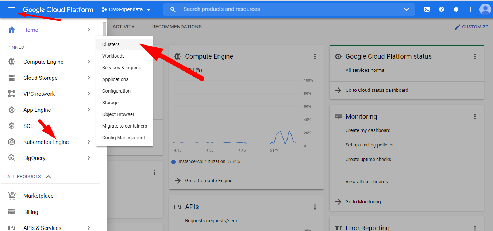
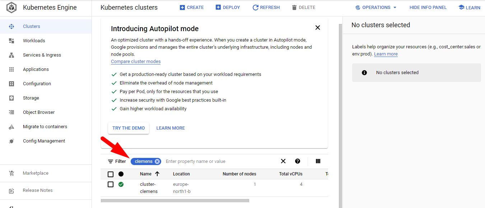
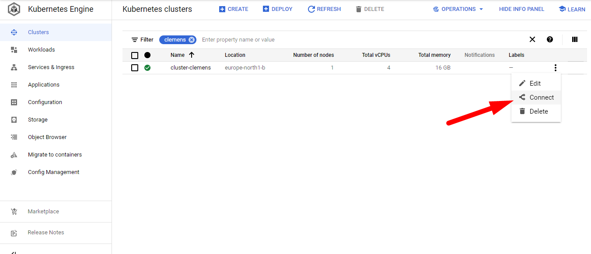
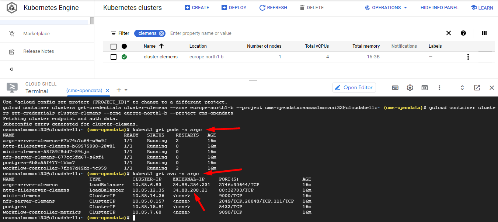
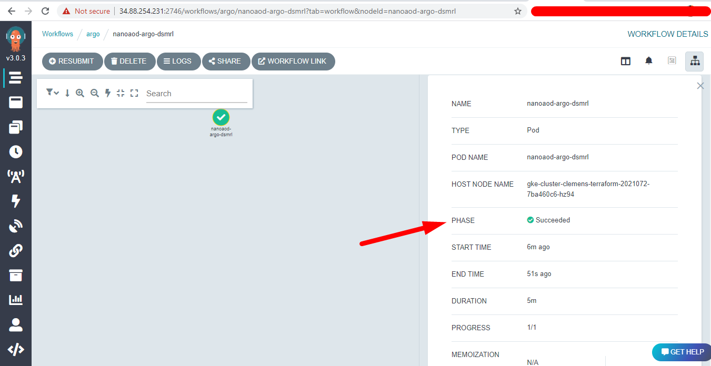
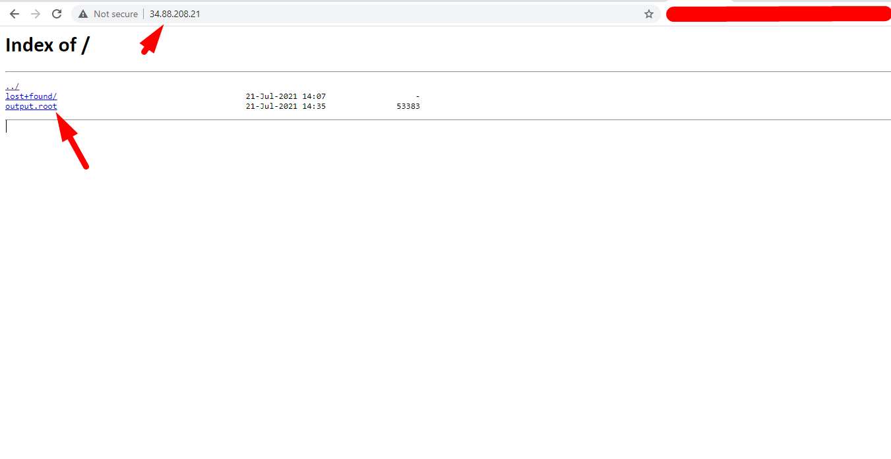

## Introduction

As it is possible to automate the process of creating resources in the cloud, we have built all the required resources for this lab in a GCP Project. 
Each participant has a special ID consisting from the first 7 letters of participant's Email [0-9a-z].

> ## Resources
>
>
>> -  gce-nfs-disk-<b>&lt;ID&gt;</b> 
> {: .prereq}
>
>
>> ## cluster-<b>&lt;ID&gt;</b> (namespace "argo")
>> - Deploymet/Service: nfs-server-<b>&lt;ID&gt;</b>
>> - Deploymet/Service: http-fileserver-<b>&lt;ID&gt;</b>
>> - Deploymet/Service: argo-server-<b>&lt;ID&gt;</b>
>> - PV/PVC: nfs-server-<b>&lt;ID&gt;</b>
> {: .prereq}
{: .callout}

For example, jo.hn2000@cern.ch has a cluster-john200 > namespace "argo" > nfs-server-john200

---

## Connect into your cluster

To connect into your cluster we are going to use GCP CloudShell. Head to GCP > GKE > Clusters

---

> ## Remmember
> You can always use the filter with your ID to list only your resources
>
> 
{: .discussion}

---

Find your cluster, press connect and chose  <b>run in cloud shell </b>

Run `kubectl get pods -n argo` to get your pods in namespace argo,  
`kubectl get svc -n argo` to see your services and their associated IPs

---

## Run a simple CMS workflow with Argo Workflows Web UI

If the steps above are successful, we are now ready to run a workflow to process CMS open data.

In your browser, head to <b>https://</b>&lt;your argo server External IP&gt;:2746

Submit a new workflow with the following YAML (Replace <ID> with your ID): 

~~~
# argo-wf-cms.yaml
apiVersion: argoproj.io/v1alpha1
kind: Workflow
metadata:
  namespace: argo
  generateName: nanoaod-argo-
spec:
  entrypoint: nanoaod-argo
  volumes:
  - name: task-pv-storage
    persistentVolumeClaim:
      claimName: nfs-<ID>
  templates:
  - name: nanoaod-argo
    script:
      image: eu.gcr.io/cms-opendata/cmssw_5_3_32
      command: [sh]
      source: |
        source /opt/cms/entrypoint.sh
        sudo chown $USER /mnt/vol
        mkdir workspace
        cd workspace
        git clone git://github.com/cms-opendata-analyses/AOD2NanoAODOutreachTool  AOD2NanoAOD
        cd AOD2NanoAOD
        scram b -j8
        nevents=100
        eventline=$(grep maxEvents configs/data_cfg.py)
        sed -i "s/$eventline/process.maxEvents = cms.untracked.PSet( input = cms.untracked.int32($nevents) )/g" configs/data_cfg.py
        cmsRun configs/data_cfg.py
        cp output.root /mnt/vol/
        echo  ls -l /mnt/vol
        ls -l /mnt/vol
      volumeMounts:
      - name: task-pv-storage
        mountPath: /mnt/vol
~~~
{: .language-yaml}

## Accessing files via http
After your workflow run successfully. 

You can get the output from your http-fileserver 
in your browser  open http-fileserver External IP

