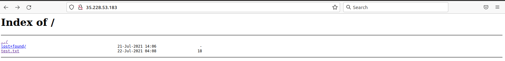
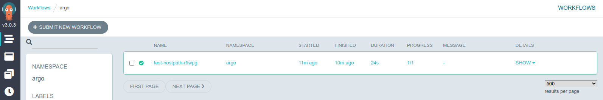

## Run a simple Argo workflow

In order to understand the logic of `yaml` files, and to watch a simple Argo workflow take place, let's use this simple exmple.  Download it your Cloud Shell terminal with:

```bash
wget https://cms-opendata-workshop.github.io/workshop2021-lesson-cloud/files/argo-wf-volume.yaml
```

Edit it with `nano` or, even better, using the incorporated editor from the console (just click on the `Open Editor` button).  Change the **\<ID\>** int the **nfs-\<ID\>** string to yours (remember this nfs-<ID> is the name of the `pvc`, where we are writing out):

~~~
#argo-wf-volume.yaml
apiVersion: argoproj.io/v1alpha1
kind: Workflow
metadata:
  generateName: test-hostpath-
spec:
  entrypoint: test-hostpath
  volumes:
    - name: task-pv-storage
      persistentVolumeClaim:
        claimName: nfs-<ID>
  templates:
  - name: test-hostpath
    script:
      image: alpine:latest
      command: [sh]
      source: |
        echo "This is the ouput" > /mnt/vol/test.txt
        echo ls -l /mnt/vol: `ls -l /mnt/vol`
      volumeMounts:
      - name: task-pv-storage
        mountPath: /mnt/vol
~~~
{: .language-yaml}


Before we submit this workflow, let's try to understand what this configuration is doing.

> ## Indentation
>
> `yaml` files are very picky about indentation: they have to, it is how they organize themselves.  Everything aligned under a certain level, corresponds to the same organizational block.  Be careful not to accidentally perturb this structure.
{: .discussion}

If you start reading it from top to bottom:
  - the first thing you would notice is some general information about the `apiVersion` it is using to communicate to the K8s framework (in this case `argoproj.io/v1alpha1`),
  - the `kind` of configuration it is (in this case a `Workflow`)
  - and some `metadata`, which includes a `generateName` that will be used to identify its products (that is basically the reason why, in this case, `test-hostpath-` was defined with an extra `-`, so if it precedes filenames, it will nicely form a string name).

The `spec` is the blue print of whole deployment.  It starts at an `entrypoint`.  It is literally the place where the workflow will start processing routines.  In this case, the entrypoint is `test-hostpath` (you can give any name to these variables but they have to be consistent with the logic of the yaml).  We have to jump down to find its definition under `templates`.  You may recognize that this template is a template of a routine or action.  These templates are identified by their `name`s, and usually have a `script`, which are the commands that will be executed.  This script needs to perform through a container (after all K8s is all about containers) and so it calls the corresponding container `image` to be downloaded.  In the present case, the container will be just a simple `alpine:latest` linux container. Whatever commands are at the `source` tag will be executed through this container.  Also, this template has a `volumeMounts`, which works very similar to what we have been doing with our own container, i.e., mounting whatever `persistentVolumeClaim` disk was defined in the `volumes` section of the `spec`, in this case `nfs-<ID>` (our `pvc`, remember?), at the `/mnt/vol` directory `mountPath`.

> `apiVersion`s seem to change from time to time, so, sometimes, that will render your yaml config file obsolete and you will have to update the api information.
{: .testimonial}

Let's submit our workflow:

```bash
argo submit -n argo argo-wf-volume.yaml
```

Yep, it fails:

~~~
-bash: argo: command not found
~~~
{: .error}

This is because, even though we have the Argo server and its workflow-controller running, we don't have the CLI to interact with it.  Let's download Argo CLI:

```bash
# Download the binary
curl -sLO https://github.com/argoproj/argo-workflows/releases/download/v3.1.2/argo-linux-amd64.gz

# Unzip
gunzip argo-linux-amd64.gz

# Make binary executable
chmod +x argo-linux-amd64

# Move binary to path
sudo mv ./argo-linux-amd64 /usr/local/bin/argo

# Test installation
argo version
```

You will see somethin like:

~~~
argo: v3.1.2
  BuildDate: 2021-07-15T21:53:44Z
  GitCommit: 98721a96eef8e4fe9a237b2105ba299a65eaea9a
  GitTreeState: clean
  GitTag: v3.1.2
  GoVersion: go1.15.7
  Compiler: gc
  Platform: linux/amd64
~~~
{: output}

Ok, now we are truly ready to submit the workflow.  Let's try again:

```bash
argo submit -n argo argo-wf-volume.yaml
```

If you check the status with:

```bash
argo list -n argo
```
you will first see something like:

~~~
NAME                  STATUS    AGE   DURATION   PRIORITY
test-hostpath-r5wpg   Running   22s   22s        0
~~~
{: .output}

but then

~~~
NAME                  STATUS      AGE   DURATION   PRIORITY
test-hostpath-r5wpg   Succeeded   29s   24s        0
~~~
{: .output}

when is finished.

If you were paying attention, this workflow should have written a `test.txt` file to our disk (which is visible externally through our http fileserver).  Aren't you eager to check whether you were able to produce it successfully?  Point your browser to the corresponding IP address.  In our case:



we succeded!

Let's also the check the Argo GUI:



If you click on the name, you can see a sort of workflow diagram.  Ok, in this case our workflow was more like a single task.  Let's make things a little bit more interesting.

## Let's spice things up

Now we are going to run some serious workflow.  What we will be doing here is to mimic a full analysis flow (so, it is a full workflow) of essentially what we did already during the workshop.  
  
We will start by automatically getting the list of files from the cern open portal with the containerized [`cernopendata-client` tool](https://cernopendata-client.readthedocs.io/en/latest/).  
  
Then we will generate a list of those files that we want to process;  we will then run a version of the `POET` code, then merge the output files into a single `ROOT` file and finally run a simplified version of the `EventLoopAnalysisTemplate` to obtain a test histogram to see if everything went well.
  
Dowload the yaml file with:

```bash
wget https://raw.githubusercontent.com/cms-opendata-workshop/workshop2021-poetpayload-cloud/master/PhysObjectExtractor/cloud/workshop_argo.yaml
```

Inspect it carefully and try to make sense of logic.  This is a good time to ask the experts in the room!

Submit your workflow and get the results.
  
You can open the http file server assigned to your cluster to see the histogram file and to download the merged output file `poetoutput.root`

Will you be able to change the workflow file to process the dataset of your choice?, the numebr of files of your choice?, etc.? Note that to run over all events in each file, you can set the number of events to -1.



